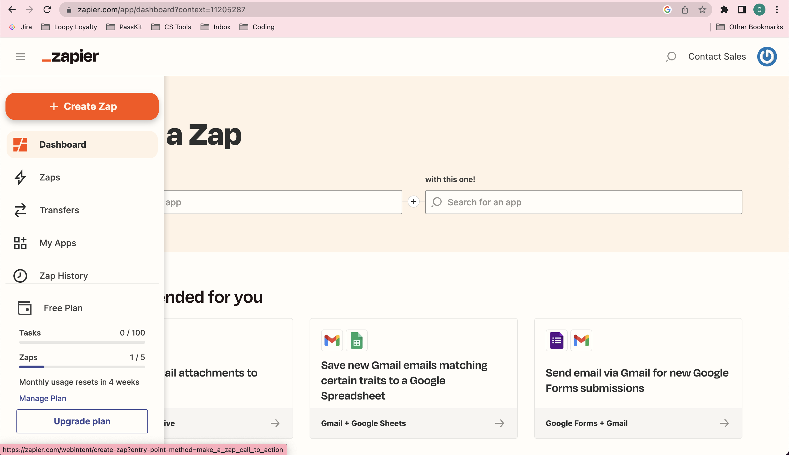
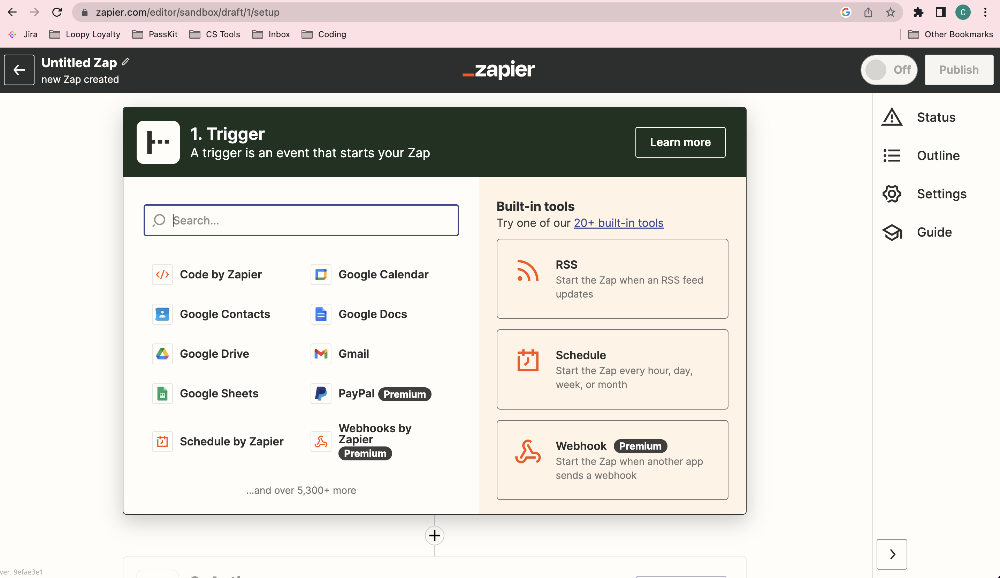
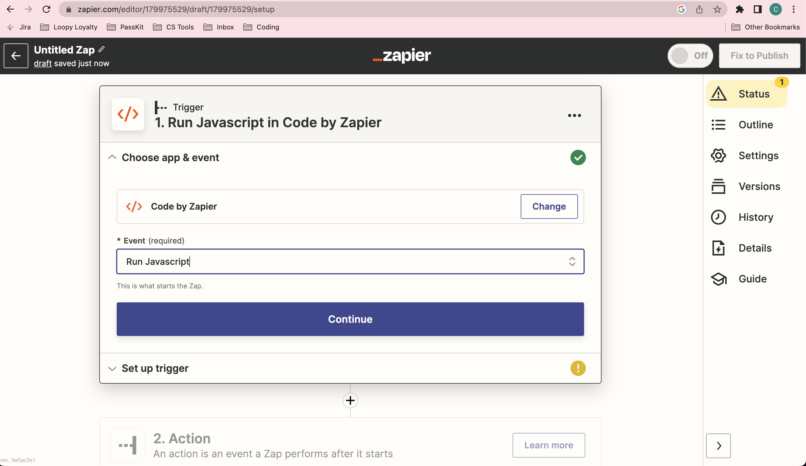
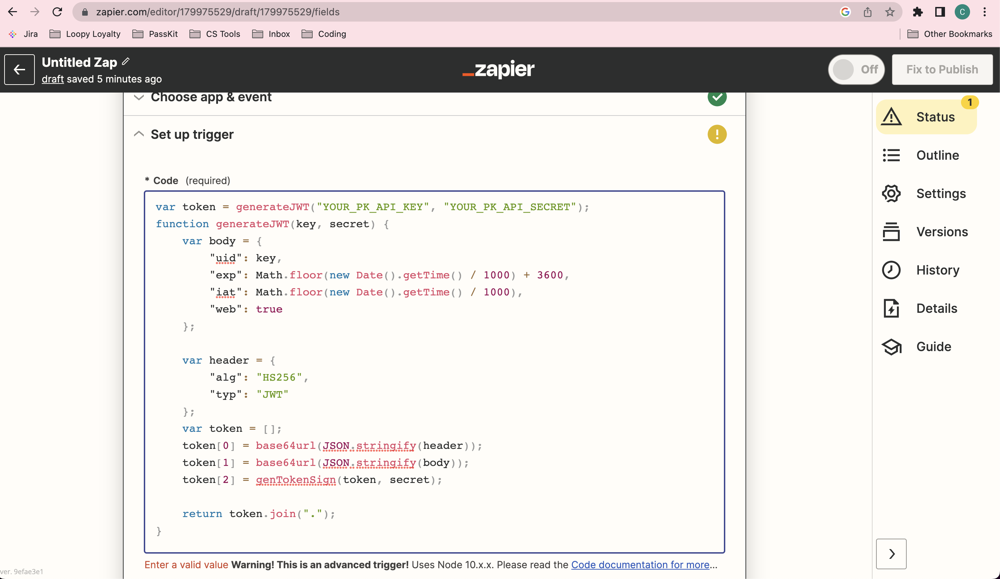
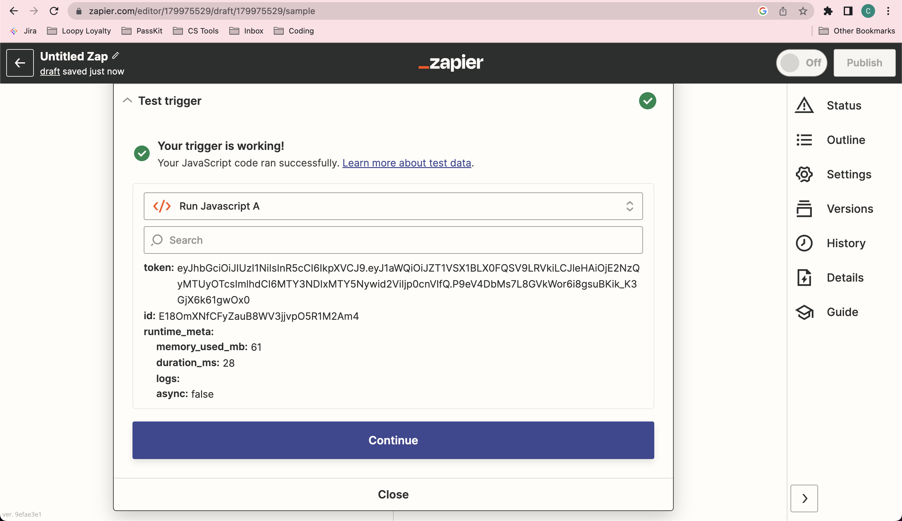

PassKit Zapier Short Lived JWT Generator 
=====================
### Overview

This code allows you to generate a short lived token in Zapier using Zapier Code.

### Prerequisites

You will need the following:

- A PassKit account (signup for free at https://app.passkit.com)
- Your PassKit REST Credentials (available from the https://app.passkit.com/app/account/developer-tools)
- A Zapier account (signup for free at https://zapier.com/sign-up)
*Please note that if you plan on using Zapier Code with any premium app ,e.g. Zapier Webhooks , a starter plan or higher is required in Zapier*

### Configuration

1. After you have completed the prerequisites, log onto Zapier and 'Create Zap' on the right hand side.
 

2. You will see the screen below. In the search bar type in Code by Zapier and select it from the list.

3. Once selected you will be able to pick an event, in the drop down list choose 'Run JavaScript' and click continue.

4. Next copy the code in the jwt-token-generator file into the Code box. On the first line of code replace `"YOUR_PK_API_KEY"` `"YOUR_PK_API_SECRET"` with the REST credentials as mentioned in the prerequisites. Then click continue. *Your screen may look different to the below and include input boxes above the code box if this is an action as opposed to a trigger. If this is the case leave the input box blank.*

5. Lastly you will need to test your trigger or action. There should be a jwt token generated shortly after testing.

To use it in any other steps in this Zap, select a box where you can insert data, select the Code by Zapier step and choose Token from the list of options.
### Support
- Introduction to Zapier (https://help.zapier.com/hc/en-us/articles/8496181725453-Learn-key-concepts-in-Zapier)
- [Online chat support](https://passkit.com/)
